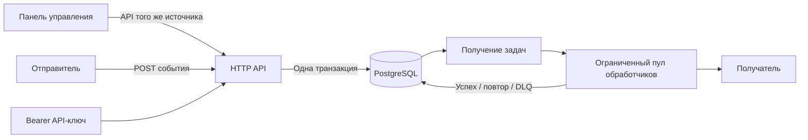

# Архитектура

## Жизненный цикл доставки

1. API сохраняет неизменяемое событие и по одной доставке для каждой выбранной
   точки назначения в единой транзакции.
2. Обработчики атомарно получают готовые доставки с помощью
   `SELECT ... FOR UPDATE SKIP LOCKED`.
3. Получатель получает постоянный ID события, время отправки, номер попытки и
   подпись HMAC-SHA256.
4. Ответ `2xx` завершает доставку успешно. Временные ошибки переносят следующую
   попытку с экспоненциальной и полностью случайной задержкой. Постоянная ошибка
   или исчерпание числа попыток переводит доставку в DLQ.

Ручной повтор обнуляет лимит попыток доставки, но сохраняет историю всех прошлых
попыток. Оператор может сравнить первоначальную ошибку с результатом повтора.

## Аутентификация и граница организации

API-ключ содержит случайный открытый префикс и 256-битный секрет. PostgreSQL
хранит только SHA-256-хеш полного ключа. Префикс выбирает одну запись-кандидата,
после чего приложение сравнивает хеши за постоянное время.

Проверенный ключ помещает созданные сервером данные организации в контекст
запроса. Клиент не может передать или подменить ID организации. Каждый запрос к
точкам назначения, событиям, доставкам и ручным повторам содержит доверенный
`tenant_id`. Ключи идемпотентности уникальны внутри организации, а не глобально.

Дополнительные организации создаются автономной командой CLI, которая показывает
первый API-ключ только один раз.

Панель управления состоит из статических файлов без внешних зависимостей,
встроенных в тот же исполняемый файл Go. Она использует защищённый API `/v1`,
хранит API-ключ только в памяти текущей вкладки и не принимает `tenant_id` от
пользователя. Строгая Content Security Policy разрешает скрипты, стили,
изображения и API-запросы только с того же источника.

## Модель отказов

В системе намеренно учитывается неоднозначный промежуток: получатель может
зафиксировать запрос, после чего обработчик остановится до записи успешного
результата. После восстановления срок блокировки истечёт, и другой обработчик
повторит доставку. Получатель обязан использовать ID события как ключ
идемпотентности.

Единственный источник истины — состояние базы данных. Очереди в памяти служат
только ограниченными буферами планирования и могут быть отброшены при остановке
или сбое процесса.

## Параллелизм и защита от шумного соседа

Число обработчиков ограничивает общую исходящую нагрузку. Дополнительный семафор
для каждой точки не позволяет одному медленному получателю занять весь общий пул.
Задачи получают короткую аренду, поэтому брошенная работа восстанавливается.

## Границы безопасности

- Все маршруты `/v1` требуют Bearer API-ключ.
- URL точек назначения ограничены протоколами HTTP(S) и проверяются через DNS
  при создании.
- Специальный механизм соединения повторно проверяет DNS перед каждым исходящим
  подключением и запрещает локальные, частные, link-local, служебные,
  многоадресные и зарезервированные диапазоны.
- Перенаправления вебхуков и исходящие прокси из переменных окружения отключены.
- Секреты не возвращаются API чтения и не записываются в журналы.
- Секреты подписи шифруются AES-256-GCM. ID организации и точки назначения
  используются как дополнительные аутентифицированные данные, поэтому шифротекст
  нельзя незаметно перенести к другой точке.
- Подлинность данных проверяется HMAC-SHA256 по времени отправки и точному телу.
- Размер сохраняемого ответа получателя ограничен.
- Сервер и операции доставки имеют явные ограничения времени.

В рабочем окружении необходимо также ограничить исходящий трафик на уровне
инфраструктуры, оставить диагностику во внутренней сети и хранить ключи шифрования
в специализированном хранилище секретов.
