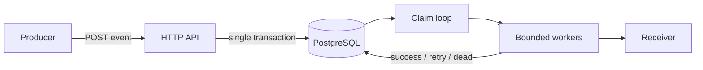

# Architecture

## Delivery lifecycle

1. The API inserts the immutable event and one delivery per selected endpoint in a
   single transaction.
2. Workers atomically claim ready deliveries with
   `SELECT ... FOR UPDATE SKIP LOCKED`.
3. The receiver gets the stable event ID, timestamp, attempt number, and an
   HMAC-SHA256 signature.
4. A `2xx` response marks the delivery successful. Retryable outcomes are
   rescheduled with exponential backoff and full jitter. Permanent failures or an
   exhausted retry budget enter the DLQ.

## Failure model

The ambiguous interval is deliberately visible: a receiver can commit the request
and the worker can crash before recording success. On recovery, the lease expires
and another worker retries the same delivery. The receiver must use the event ID as
an idempotency key.

Database state is the source of truth. In-memory queues are only bounded scheduling
buffers and can be discarded during shutdown or process failure.

## Concurrency and noisy-neighbour isolation

The worker count caps total outbound pressure. A second semaphore is keyed by
endpoint, preventing one slow receiver from occupying the entire global pool.
Claims use short leases so abandoned work is recoverable.

## Security boundaries

- Endpoint URLs are validated as HTTP(S) at creation time.
- Secrets are never returned by read APIs or logged.
- Payload authenticity uses HMAC-SHA256 over the timestamp and exact body.
- Response bodies are bounded before capture.
- Server and delivery timeouts are explicit.

Production deployments should encrypt endpoint secrets at rest and apply an
egress allowlist to prevent server-side request forgery.

