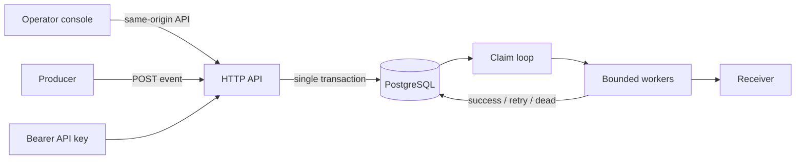

# Architecture

## Delivery lifecycle

1. The API inserts the immutable event and one delivery per selected endpoint in a
   single transaction.
2. Workers atomically claim ready deliveries with
   `SELECT ... FOR UPDATE SKIP LOCKED`.
3. The receiver gets the stable event ID, timestamp, attempt number, and an
   HMAC-SHA256 signature.
4. A `2xx` response marks the delivery successful. Retryable outcomes are
   rescheduled with exponential backoff and full jitter. Permanent failures or an
   exhausted retry budget enter the DLQ.

Manual replay resets the delivery retry budget but preserves every historical
attempt, so an operator can compare the original failure with the replay.

## Authentication and tenant boundary

API keys contain a random public prefix and a 256-bit secret. PostgreSQL stores
only a SHA-256 digest of the complete key. The prefix selects one candidate record;
the application verifies the digest with a constant-time comparison.

The authenticated key places a server-created tenant principal in the request
context. Clients cannot supply or override a tenant ID. Every endpoint, event,
delivery, and replay query includes that trusted `tenant_id`, and idempotency keys
are unique inside a tenant rather than globally.

Additional tenants are provisioned through an offline CLI command, which returns
the initial API key once.

The operator console is a dependency-free set of embedded static assets served by
the same Go binary. It uses the same authenticated `/v1` API as every other
client, keeps the API key only in the current tab's memory, and never accepts a
client-supplied tenant ID. A restrictive Content Security Policy permits scripts,
styles, images, and API connections only from the same origin.

## Failure model

The ambiguous interval is deliberately visible: a receiver can commit the request
and the worker can crash before recording success. On recovery, the lease expires
and another worker retries the same delivery. The receiver must use the event ID as
an idempotency key.

Database state is the source of truth. In-memory queues are only bounded scheduling
buffers and can be discarded during shutdown or process failure.

## Concurrency and noisy-neighbour isolation

The worker count caps total outbound pressure. A second semaphore is keyed by
endpoint, preventing one slow receiver from occupying the entire global pool.
Claims use short leases so abandoned work is recoverable.

## Security boundaries

- All `/v1` routes require a Bearer API key.
- Endpoint URLs are restricted to HTTP(S) and resolved at creation time.
- A custom dialer resolves and filters DNS again for every outbound connection,
  blocking loopback, private, link-local, metadata, multicast, and reserved ranges.
- Webhook redirects and environment-configured outbound proxies are disabled.
- Secrets are never returned by read APIs or logged.
- Endpoint signing secrets are encrypted with AES-256-GCM. Tenant and endpoint IDs
  are authenticated as associated data, preventing ciphertext relocation.
- Payload authenticity uses HMAC-SHA256 over the timestamp and exact body.
- Response bodies are bounded before capture.
- Server and delivery timeouts are explicit.

Production deployments should additionally enforce an infrastructure egress
allowlist, keep diagnostics on a private network, and store encryption keys in a
managed secret service.
