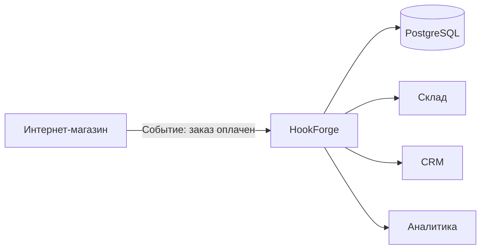
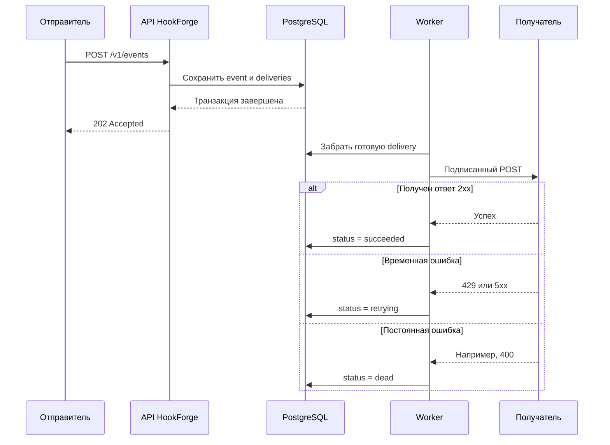

# HookForge: объяснение с нуля

Это руководство рассчитано на человека, который раньше не работал с Go,
PostgreSQL, API или вебхуками. Для понимания не требуется знать программирование.

## Что делает HookForge

Представим интернет-магазин. После оплаты заказа ему нужно сообщить нескольким
другим системам:

- складу — что товар пора собирать;
- службе доставки — что появилась посылка;
- CRM — что клиент сделал покупку;
- системе аналитики — что произошла продажа.

Интернет-магазин мог бы самостоятельно отправлять четыре HTTP-запроса. Но одна из
систем может быть временно выключена, отвечать слишком медленно или оборвать
соединение. Если магазин просто забудет о неудачном запросе, важное событие будет
потеряно.

HookForge работает как надёжная курьерская служба:

1. принимает событие от основной системы;
2. сохраняет его в PostgreSQL;
3. сразу подтверждает, что событие принято;
4. доставляет копию каждому указанному получателю;
5. повторяет временно неудачные попытки;
6. сохраняет историю доставки;
7. переносит окончательно не доставленные сообщения в DLQ.



Главная идея: отправитель передаёт событие один раз и больше не отвечает за
повторные попытки доставки.

## Основные термины

### HTTP

HTTP — это набор правил, по которым программы обмениваются данными через сеть.
Браузер использует HTTP, когда открывает сайт. HookForge использует тот же
механизм, только программы общаются друг с другом без участия человека.

### API

API — это описанный набор адресов и команд программы. Например:

- `POST /v1/events` — принять новое событие;
- `GET /v1/deliveries` — показать доставки;
- `POST /v1/deliveries/{id}/replay` — повторить доставку из DLQ.

`GET` обычно читает данные, а `POST` создаёт объект или запускает действие.

### JSON

JSON — текстовый формат данных. Событие о заказе может выглядеть так:

```json
{
  "type": "order.created",
  "payload": {
    "order_id": "42",
    "amount": 1990
  }
}
```

### Вебхук

Вебхук — HTTP-запрос, который одна система автоматически отправляет другой после
какого-либо события. Это похоже на уведомление: «не спрашивай меня каждую минуту,
появился ли заказ; я сам сообщу, когда он появится».

### Endpoint

Endpoint в HookForge — адрес получателя вебхука. Например:
`https://warehouse.example.com/webhooks/orders`.

### Event

Event, или событие, — факт, который уже произошёл: заказ создан, платёж принят,
пользователь зарегистрирован.

### Delivery и attempt

Delivery — задача доставить одно событие одному endpoint. Attempt — отдельная
попытка выполнить эту задачу. У одной delivery может быть несколько attempts.

### Worker

Worker — фоновый исполнитель. Он берёт готовую задачу из PostgreSQL, отправляет
HTTP-запрос и сохраняет результат.

### Retry и backoff

Retry — повторная попытка. HookForge не повторяет запрос немедленно и бесконечно.
Он постепенно увеличивает паузу между попытками. Это называется exponential
backoff.

К рассчитанной паузе добавляется случайность — jitter. Благодаря этому тысячи
задач после общего сбоя не начинают повторную отправку одновременно.

### DLQ

DLQ расшифровывается как dead-letter queue. Туда попадают доставки, которые
исчерпали число попыток или получили ошибку, которую бессмысленно повторять.
Оператор может устранить причину и запустить replay вручную.

### Идемпотентность

Повтор одного и того же запроса не должен создавать два разных события. Поэтому
отправитель передаёт заголовок `Idempotency-Key`.

Например, оба запроса с ключом `payment-42` вернут одно и то же сохранённое
событие. Первый ответ будет `202 Accepted`, повторный — `200 OK` с признаком
`"duplicate": true`.

### HMAC-подпись

У каждого endpoint есть секрет. HookForge подписывает им тело запроса. Получатель
может самостоятельно вычислить подпись и сравнить её с заголовком
`X-HookForge-Signature`.

Это позволяет проверить две вещи:

- запрос действительно сформировал владелец секрета;
- тело запроса не изменилось по дороге.

Секрет возвращается при создании endpoint только один раз. Его нельзя публиковать
в Git или записывать в обычные логи.

## Как проходит одно событие



Event и связанные deliveries сохраняются в одной транзакции. Транзакцию можно
представить как правило «либо записать всё, либо не записать ничего». Ситуации, в
которой событие сохранилось, а задачи доставки потерялись, быть не должно.

## Почему гарантия называется at-least-once

HookForge гарантирует доставку «как минимум один раз», пока получатель доступен и
ошибка допускает повтор.

Возможен редкий сценарий:

1. получатель успешно сохранил вебхук;
2. соединение оборвалось до ответа или worker остановился;
3. HookForge не успел записать успешный результат;
4. после восстановления HookForge отправил событие повторно.

Через ненадёжную сеть нельзя одновременно гарантировать, что запрос никогда не
потеряется и никогда не повторится. Поэтому HookForge не обещает «ровно один раз».
Получатель должен запоминать `X-HookForge-Event-ID` и игнорировать уже обработанный
ID.

## Из чего состоит проект

| Путь | Назначение |
| --- | --- |
| `cmd/hookforge` | запуск приложения и корректное завершение |
| `internal/api` | HTTP API, JSON и проверка входных данных |
| `internal/store` | операции API с PostgreSQL |
| `internal/delivery` | worker pool, подписи, retry, leases и DLQ |
| `internal/database` | подключение к базе и миграции |
| `internal/observability` | метрики Prometheus |
| `ops` | настройки Prometheus и Grafana |
| `docs` | архитектура, OpenAPI и инструкции |
| `load` | нагрузочный сценарий k6 |
| `compose.yaml` | запуск всех локальных компонентов |

Если вы только начинаете читать код, рекомендуемый порядок:

1. `internal/domain/model.go` — какие данные существуют;
2. `internal/api/api.go` — какие запросы принимает программа;
3. `internal/store/postgres.go` — как события записываются в базу;
4. `internal/delivery/runner.go` — как выполняется доставка;
5. `internal/delivery/postgres.go` — как workers забирают и завершают задачи;
6. `cmd/hookforge/main.go` — как всё соединяется в приложение.

## Что запускается через Docker Compose

| Сервис | Адрес | Для чего нужен |
| --- | --- | --- |
| HookForge | `http://localhost:8080` | основной API |
| PostgreSQL | `localhost:5432` | хранение событий и доставок |
| Prometheus | `http://localhost:9091` | сбор метрик |
| Grafana | `http://localhost:3000` | графики и dashboard |

У HookForge также есть внутренний diagnostics-порт `9090`. Его не следует
публиковать в интернет: там находятся метрики и профили Go.

## Первый запуск

Самый простой путь — установить Git и Docker Desktop.

Склонируйте репозиторий:

```bash
git clone https://github.com/PCenjoyer/GoProject.git
cd GoProject
```

Запустите систему:

```bash
docker compose up --build
```

Первый запуск может занять несколько минут, потому что Docker скачивает образы.
Не закрывайте это окно: в нём отображаются логи.

Откройте второй терминал и проверьте готовность:

```bash
curl http://localhost:8080/readyz
```

В PowerShell лучше явно использовать `curl.exe`:

```powershell
curl.exe http://localhost:8080/readyz
```

Ожидаемый ответ:

```text
ready
```

## Проверка настоящей доставки

Для теста нужен HTTP-сервер, который будет играть роль получателя. Если на
компьютере установлен Python 3, запустите в отдельном PowerShell:

```powershell
@'
from http.server import BaseHTTPRequestHandler, HTTPServer

class Receiver(BaseHTTPRequestHandler):
    def do_POST(self):
        size = int(self.headers.get("Content-Length", "0"))
        body = self.rfile.read(size)
        print("\nПолучен вебхук:")
        print(body.decode("utf-8"))
        print("Event ID:", self.headers.get("X-HookForge-Event-ID"))
        print("Signature:", self.headers.get("X-HookForge-Signature"))
        self.send_response(204)
        self.end_headers()

HTTPServer(("0.0.0.0", 8090), Receiver).serve_forever()
'@ | python -
```

Если HookForge запущен в Docker Desktop, адрес получателя будет
`http://host.docker.internal:8090/webhook`.

Создайте endpoint:

```powershell
$endpointBody = @{
    name = "local-receiver"
    url = "http://host.docker.internal:8090/webhook"
} | ConvertTo-Json

$endpoint = Invoke-RestMethod `
    -Method Post `
    -Uri "http://localhost:8080/v1/endpoints" `
    -ContentType "application/json" `
    -Body $endpointBody

$endpoint
```

В ответе найдите значения `endpoint.id` и `secret`. Секрет нужен получателю для
проверки подписей. PowerShell уже сохранил ответ в переменной `$endpoint`, поэтому
в следующей команде ID подставится автоматически:

```powershell
$eventBody = @{
    type = "order.created"
    payload = @{
        order_id = "42"
    }
    endpoint_ids = @($endpoint.endpoint.id)
} | ConvertTo-Json -Depth 5

Invoke-RestMethod `
    -Method Post `
    -Uri "http://localhost:8080/v1/events" `
    -ContentType "application/json" `
    -Headers @{"Idempotency-Key" = "first-order-42"} `
    -Body $eventBody
```

В окне Python-получателя появится тело вебхука, Event ID и подпись.

Посмотреть доставки можно командой:

```powershell
Invoke-RestMethod -Uri "http://localhost:8080/v1/deliveries" | ConvertTo-Json -Depth 5
```

У успешно доставленной задачи будет статус `succeeded`.

## Как увидеть retry

Остановите Python-получатель сочетанием `Ctrl+C`, затем отправьте новое событие с
новым `Idempotency-Key`. HookForge не сможет подключиться и переведёт delivery в
`retrying`.

После следующей команды будут видны число попыток и последняя ошибка:

```powershell
Invoke-RestMethod -Uri "http://localhost:8080/v1/deliveries?status=retrying" | ConvertTo-Json -Depth 5
```

Запустите получателя снова. После очередной попытки статус изменится на
`succeeded`.

## Как остановить проект

В окне с Docker Compose нажмите `Ctrl+C`, затем выполните:

```bash
docker compose down
```

Чтобы также удалить локальные данные PostgreSQL:

```bash
docker compose down -v
```

Команда с `-v` необратимо удаляет локальную базу этого Compose-проекта.

## Частые проблемы

### `docker` не является командой

Docker Desktop не установлен или не запущен. Установите его, запустите приложение
и откройте новый терминал.

### Порт уже занят

Другая программа использует `8080`, `5432`, `9091` или `3000`. Остановите её либо
измените левую часть соответствующего `ports` в `compose.yaml`.

### Ответ `database unavailable`

PostgreSQL ещё запускается или завершился с ошибкой. Посмотрите логи:

```bash
docker compose logs postgres
```

### Событие остаётся в `retrying`

Проверьте:

- доступен ли endpoint из контейнера HookForge;
- правильно ли указан адрес и порт;
- принимает ли получатель метод `POST`;
- не отвечает ли он кодом `429` или `5xx`.

### Почему повтор с тем же ключом не создаёт новое событие

Это ожидаемая работа идемпотентности. Для нового события используйте новый
`Idempotency-Key`.

## Что показывают Prometheus и Grafana

Prometheus регулярно читает числовые метрики HookForge. Grafana строит по ним
графики:

- сколько попыток выполняется;
- сколько доставок успешны, повторяются или попали в DLQ;
- сколько запросов сейчас выполняется;
- какова p95-задержка доставки;
- как часто endpoint достигает лимита параллелизма.

p95 означает: 95% операций завершились не медленнее указанного времени, а 5% были
медленнее. Для сетевых систем p95 и p99 обычно полезнее среднего значения.

## Что уже проверяет CI

После каждого push GitHub Actions:

- запускает все тесты с детектором гонок;
- выполняет `go vet`;
- собирает бинарный файл;
- собирает Docker image.

Зелёный CI не доказывает отсутствие всех ошибок, но защищает от многих случайных
поломок.

## Что ещё требуется перед реальным production

Текущая реализация показывает надёжную доставку и подходит как сильный учебный или
портфолио-проект. Перед хранением реальных клиентских данных необходимо добавить:

- аутентификацию и авторизацию API;
- изоляцию организаций и пользователей;
- шифрование секретов endpoint в базе;
- защиту исходящих запросов от SSRF;
- TLS и управление ключами;
- резервное копирование и проверку восстановления;
- правила хранения и удаления старых событий;
- production-настройки PostgreSQL и мониторинга.

Не следует размещать API из локального Compose напрямую в интернете.

## Идеи следующих этапов

### 1. Multi-tenancy и безопасность

Добавить организации, API-ключи, роли и принадлежность каждого event/endpoint
конкретной организации. Шифровать secrets в PostgreSQL, поддержать их ротацию и
запретить доставку в loopback, private и metadata-сети.

Это наиболее важное продолжение: оно превращает техническое ядро в основу
реального SaaS.

### 2. Управление endpoint

Добавить изменение URL, временное отключение, проверочный webhook, ротацию секрета,
фильтры событий и журнал административных изменений.

### 3. Массовый replay

Разрешить безопасно повторять группу событий по времени, типу или endpoint.
Потребуются preview, лимит скорости, подтверждение операции и audit log, чтобы
replay не создал внезапный всплеск нагрузки.

### 4. Веб-интерфейс

Создать dashboard со списком endpoint, событиями, историей attempts, просмотром
ошибок, кнопкой replay и графиками. Это сделает проект понятным при демонстрации без
использования `curl`.

### 5. CLI и SDK

Добавить CLI для создания endpoint и replay, а также небольшие Go/TypeScript SDK
для отправки событий и проверки HMAC-подписей.

### 6. Горизонтальное масштабирование

Проверить несколько экземпляров HookForge одновременно, добавить распределённый
per-endpoint rate limit и fairness между организациями. Провести нагрузочные тесты
и записать измеренные throughput, p95, p99 и потребление памяти.

### 7. Chaos и интеграционные тесты

Автоматически проверять падение worker после ответа получателя, потерю соединения с
PostgreSQL, медленные endpoint и корректность восстановления lease. Для этого
подойдут Testcontainers и Toxiproxy.

### 8. Долговременное хранение

Добавить партиционирование таблиц, политику retention, архивирование старых payload
в S3-совместимое хранилище и очистку без долгих блокировок PostgreSQL.

### 9. OpenTelemetry

Добавить распределённые traces от приёма события до каждой попытки доставки и
связать trace ID со структурированными логами.

### Рекомендуемый порядок

1. Multi-tenancy, API-ключи, SSRF-защита и шифрование secrets.
2. Полное управление endpoint и audit log.
3. Веб-интерфейс.
4. Массовый replay с ограничением нагрузки.
5. Chaos-тесты и подтверждённые benchmark-результаты.
6. Горизонтальное масштабирование и долговременное хранение.

Такой порядок сначала закрывает риски безопасности, затем улучшает демонстрацию и
только после этого усложняет масштабирование.

## Куда идти дальше

- Техническая архитектура: [architecture.md](architecture.md)
- Полное описание HTTP API: [openapi.yaml](openapi.yaml)
- Инструкция для эксплуатации: [runbook.md](runbook.md)
- Основная страница проекта: [README.md](../README.md)
